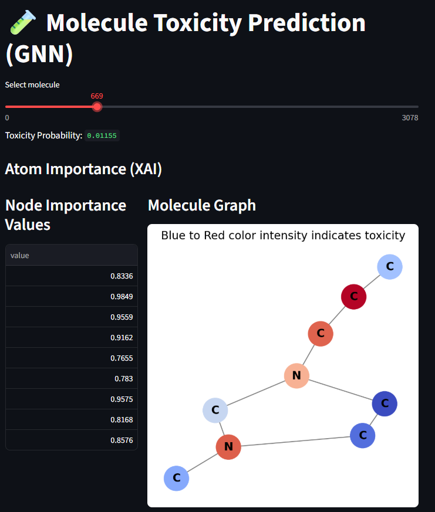

#  Molecule Toxicity Prediction with Graph Neural Networks

A **self‑contained** Python project that trains a Graph Convolutional Network (GCN) on the **Tox21** molecular toxicity dataset (via the `MoleculeNet` collection) and serves an interactive web UI with **Streamlit** to explore predictions and per‑atom importance (XAI).

---


## Project Structure

```
gnn/
├─ app.py                # Streamlit UI – loads the saved model & visualises molecules
├─ data.py               # Loads the MoleculeNet Tox21 dataset, splits train/test, creates DataLoaders
├─ model.py              # Core GCN definition (flexible `in_channels` argument)
├─ train.py              # Training loop, saves `gnn_tox21.pth`
├─ visualise.py          # Converts a `torch_geometric` graph to a NetworkX plot with RDKit atom labels
├─ xai.py                # Simple gradient‑based node importance (per‑atom attribution) 
├─ requirements.txt      # List of dependencies
```

---

## Future Improvements

* **More sophisticated XAI** – integrate Integrated Gradients or GNNExplainer for richer explanations.
* **Multi‑task learning** – Tox21 actually contains 12 toxicity endpoints; extend the model to predict all simultaneously.
* **GPU acceleration** – switch to a CUDA‑enabled environment for faster training on larger batches.
* **Dockerisation** – wrap the whole stack in a Docker image for reproducible deployment.
* **Model checkpointing** – add early‑stopping and best‑model saving based on validation loss.

---


